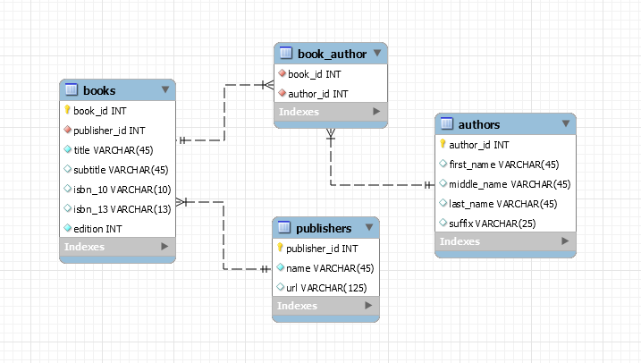

# book-collection-service-node

## Goals of this project

- Explore and learn how to create a RESTful service with Node.js and Express.
- Explore and learn how to use Sequlize ORM with a MySQL database
- Create a simple yet functioal RESTful service that can serve as a sandbox for future learning and exploration.

## Database Design and Schema Generation
 MySQL Workbench was used to design and generate the database schema for this project.

 > see: design/book-collection-data-model.mwb

One option to generate the database schema is that you can Forward Engineer the data model to create the database from MySQL Workbench.

Alternatively, The database create sql script file is included in the design folder with the name db-create.sql

Both the model and the script contain some sample data for use in testing the API.

## SQL commands to create the configured database user and grant permissions

    create user 'book_collection_user'@'localhost' identified by 'password';
    grant all on book_collection.* to 'book_collection_user'@'localhost';

 > see: config/config.json

## Sequelize ORM
[Sequelize](https://sequelize.org) has a CLI (Command Line Interface) which can be helpful for getting started with creating models.  Sequelize has some default behaviors to be mindful of. The two that I have run into so far are that it generates a primary key named "id" for every model and timestamp audit fields createdAt and updatedAt.  I chose to have more descriptive names for my primary key columns, and I did not want audit timestamp fields (at least not yet) for this simple example and so had to also disable them in the database config.json file as you will see below.

 ## Override Sequalize timestamp audit fields

 The sequalize timestamp audit fields have been disabled in this project.  This is done by placing the following block of code in config.json.
 
    "define": { 
      "timestamps": false
    }

> see: config.json in this project for example.

One of the goals that was realized with this project was how to implement one-to-many and many-to-many relationships using Sequelize.

The association is coded in the associate function of the models for Book, Author, and Publisher.

Each method in the controller can specify which data to include in the response json from the defined associations.  For example on the Book controller, findOne() returns the publisher and authors for the given bookId, but findAll() only returns the publisher.

## Project Structure

> To start service at the command prompt type 'node service'
- Entry point of application is service.js
- service.js is in the top level driectory of the project.
- For now, the service is hardcoded to run on port 5000.  This is specified in the function service.listen()
-  routes aka endpoints are imported into service.js in the require() statements.
- routes are in the project folder service/routes
- each route specifies the implememting controller.
- controllers are in the project folder service/controllers
- each Controller specifies which model(s) (persistance layer) is/are required.
- models are in the project folder service/models.

## Test Data Scenarios

The 3 main resources are books, authors, and publishers.  Each has a findAll capability, and their resource urls respectively are:
- http://localhost:5000/books
- http://localhost:5000/authors
- http://localhost:5000/publishers

The following relationships have been implemented:
- Each Book has one Publisher.
- Each Book has one or more authors.
- Each Author has one or more books.

In the test data provide, the books with bookId 1, and bookId 2 each have two authors.
      
- http://localhost:5000/books/1
- http://localhost:5000/books/2

The book with bookId 3 has ony one author.

- http://localhost:5000/books/3

## TODO list
- implement update
- implement delete
- implement patch
- implement search books by partial title
- implement search authors by partial name