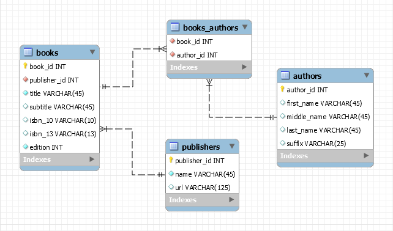

# book-collection-service-node
Sample Service using Node.js, Express, and Sequelize ORM with MySQL database

## Database Design and Schema Generation
[Sequelize](https://sequelize.org) has a CLI (Command Line Interface) which can be helpful for creating tables, etc.., but Sequelize is somewhat opioniated on generating a primary key named "id" for every model and timestamp audit fields createdAt and updatedAt by default.

I took another approach for this project as the database schema for this project was designed and generated using MySQL Workbench.

See: design/book-collection-data-model.mwb

One option to generate the database schema is that you can Forward Engineer the data model to create the database from MySQL Workbench.

The database create sql script file is also included in the design folder with the name db-create.sql

Both the model and the script contain some sample data for use in testing the API.

## SQL commands to create the configured database user and grant permissions

 create user 'reader'@'localhost' identified by 'password';

 grant all on book_collection.* to 'reader'@'localhost';

 // see config/config.json

 ## Override Sequalize timestamp audit fields

 The sequalize timestamp audit fields have been disabled in this project.  This is done by placing the following block of code in config.json.
 
     "define": { 
      "timestamps": false
    }

See config.json in this project for example.